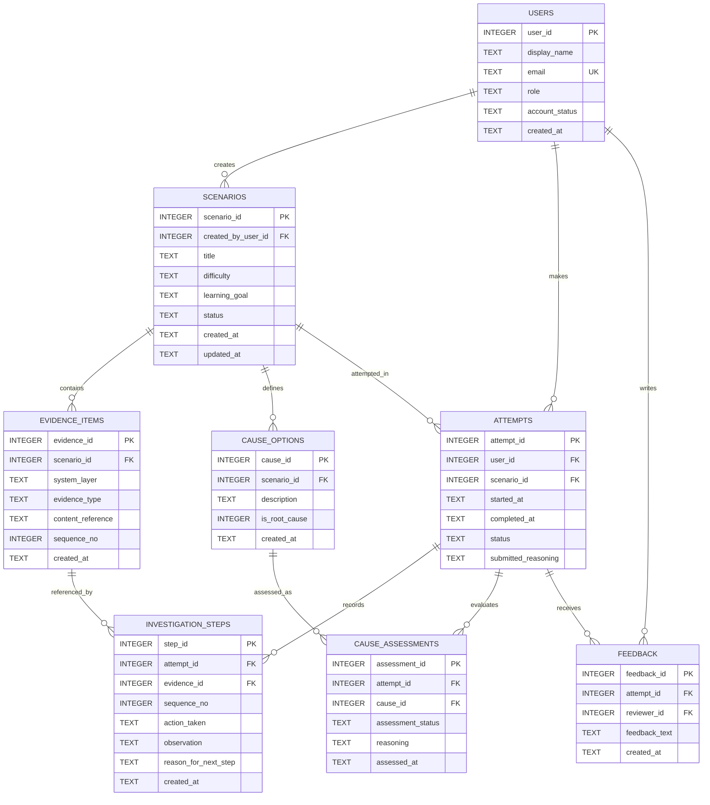

# FirstCommit — Physical Database ERD

This ERD is the **Project 02 physical relational model**.

It carries forward the eight conceptual entities from Project 01 and adds implementation details required by a working database. The most visible refinement is `SCENARIOS.created_by_user_id`, which records the reviewer responsible for creating the scenario.

